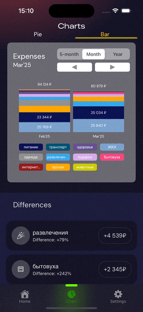

# Mokpon iOS App

## My First SwiftUI App with a Google Firebase Backend

Mokpon is a personal finance app designed to help users track and manage their expenses. Users can add, view, and delete transactions in any of three supported currencies: USD, RUB, and KGS. The app design is based on [this Figma project](https://www.figma.com/design/GSeAXliXQ5eRHctpajndMx/Expensify---Budget-Tracker-App-(Community)-(Copy)?node-id=135-318&node-type=canvas&t=ZsRKasw5FC0djWeS-0).

---

## Authentication

Users can sign in using their email, Google account, or skip the login step to use the app anonymously.  

---

## Home

The home screen allows users to calculate expenses, select categories, and add transactions to the database.  

---

## Charts

A visual overview of all expenses is available for the selected month.  

---

## Settings

Users can view their profile information and log out from this screen.  

